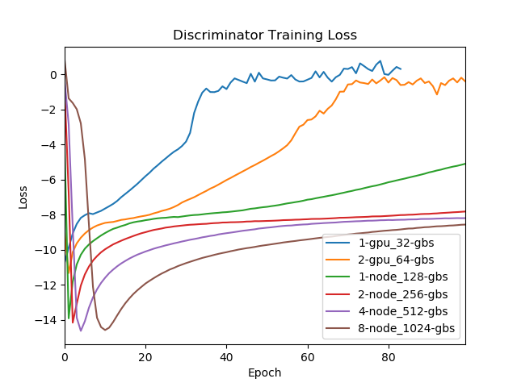
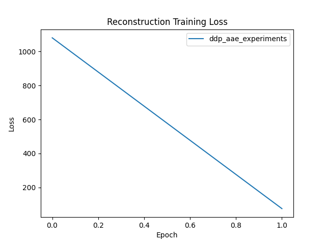
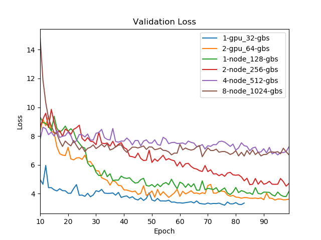

# DDP experiments for the Adversarial Autoencoder (AAE) model.

Our scaling study measures AAE training performance for the following scanarios:

| Nodes       | GPUs        | Global Batch Size |
|    :----:   |    :----:   |    :----:   |
| 1           | 1           | 32          |
| 1           | 2           | 64          |
| 1           | 4           | 128         |
| 2           | 8           | 256         |
| 4           | 16          | 512         |
| 8           | 32          | 1024        |

Note: Each GPU has 16GB of memory which can fit a maximum local batch size of 32.

The aae_template.yaml file stores the model hyperparameters and training settings.

We have prepared sbatch submission scripts for each of the above experiments. They can be run as follows:
```
chmod +x ./ddp_aae_experiments/bin/submit_1-gpu_32-gbs.sh
chmod +x ./ddp_aae_experiments/bin/submit_1-gpu_64-gbs.sh
chmod +x ./ddp_aae_experiments/bin/submit_1-node_128-gbs.sh
chmod +x ./ddp_aae_experiments/bin/submit_2-node_256-gbs.sh
chmod +x ./ddp_aae_experiments/bin/submit_4-node_512-gbs.sh
chmod +x ./ddp_aae_experiments/bin/submit_8-node_1024-gbs.sh

sbatch ./ddp_aae_experiments/bin/submit_1-gpu_32-gb.sh
sbatch ./ddp_aae_experiments/bin/submit_1-gpu_64-gbs.sh
sbatch ./ddp_aae_experiments/bin/submit_1-node_128-gbs.sh
sbatch ./ddp_aae_experiments/bin/submit_2-node_256-gbs.sh
sbatch ./ddp_aae_experiments/bin/submit_4-node_512-gbs.sh
sbatch ./ddp_aae_experiments/bin/submit_8-node_1024-gbs.sh
```

***

We report training benchmark results in the following table:

| Nodes       | GPUs        | Global Batch Size | Samples/second | Seconds/batch | Seconds/epoch |
|    :----:   |    :----:   |    :----:   |    :----:   |    :----:   |    :----:   |
| 1           | 1           | 32          | 244         | 0.131       | 428.632     |
| 1           | 2           | 64          | 488         | 0.131       | 214.316     |
| 1           | 4           | 128         | 977         | 0.131       | 107.158     |
| 2           | 8           | 256         | 1954        | 0.131       | 53.579      |
| 4           | 16          | 512         | 3909        | 0.131       | 26.780      |
| 8           | 32          | 1024        | 7816        | 0.131       | 13.395      |

Note: The code reports Seconds/batch and we use this to compute Seconds/epoch and Samples/second. Since we reserve 20% of the data for validation, we are left with 104704 training examples. We compute the following:
```
Seconds/epoch = (104704 / GlobalBatchSize) * 0.131 Seconds/batch
Samples/second = 104704 / (Seconds/epoch)
```
***

Here are the loss curves for the above runs, generated by running the following commands:
```
idev -m 5 -n 1 -N 1
module load python3
cd /scratch/06079/tg853783/ddmd/src/DeepDriveMD-Longhorn-2021/ddp_aae_experiments
python generate_loss_curves.py
```





Note: The loss from the first 10 epochs is ommited to see end behavior clearly.

***

To generate latent embeddings in inference mode for each of the models, run the following:
```
idev -m 15 -n 1 -N 1
module load conda
conda activate /scratch/06079/tg853783/ddmd/envs/pytorch.mpi
cd /scratch/06079/tg853783/ddmd/src/DeepDriveMD-Longhorn-2021/ddp_aae_experiments

python inference.py \
--config /scratch/06079/tg853783/ddmd/src/DeepDriveMD-Longhorn-2021/ddp_aae_experiments/aae_template.yaml \
--data_path /scratch/06079/tg853783/ddmd/data/preprocessed/spike-all-AAE.h5 \
--model_path /scratch/06079/tg853783/ddmd/runs/ddp_aae_experiments/1-gpu_32-gbs/checkpoint/epoch-80-20210730-051859.pt \
--output_path /scratch/06079/tg853783/ddmd/src/DeepDriveMD-Longhorn-2021/ddp_aae_experiments/embeddings/1-gpu_32-gbs_80-epoch.npy

python inference.py \
--config /scratch/06079/tg853783/ddmd/src/DeepDriveMD-Longhorn-2021/ddp_aae_experiments/aae_template.yaml \
--data_path /scratch/06079/tg853783/ddmd/data/preprocessed/spike-all-AAE.h5 \
--model_path /scratch/06079/tg853783/ddmd/runs/ddp_aae_experiments/2-gpu_64-gbs/checkpoint/epoch-100-20210730-014726.pt \
--output_path /scratch/06079/tg853783/ddmd/src/DeepDriveMD-Longhorn-2021/ddp_aae_experiments/embeddings/2-gpu_64-gbs_100-epoch.npy

python inference.py \
--config /scratch/06079/tg853783/ddmd/src/DeepDriveMD-Longhorn-2021/ddp_aae_experiments/aae_template.yaml \
--data_path /scratch/06079/tg853783/ddmd/data/preprocessed/spike-all-AAE.h5 \
--model_path /scratch/06079/tg853783/ddmd/runs/ddp_aae_experiments/1-node_128-gbs/checkpoint/epoch-100-20210727-180344.pt \
--output_path /scratch/06079/tg853783/ddmd/src/DeepDriveMD-Longhorn-2021/ddp_aae_experiments/embeddings/1-node_128-gbs_100-epoch.npy

python inference.py \
--config /scratch/06079/tg853783/ddmd/src/DeepDriveMD-Longhorn-2021/ddp_aae_experiments/aae_template.yaml \
--data_path /scratch/06079/tg853783/ddmd/data/preprocessed/spike-all-AAE.h5 \
--model_path /scratch/06079/tg853783/ddmd/runs/ddp_aae_experiments/2-node_256-gbs/checkpoint/epoch-100-20210727-184901.pt \
--output_path /scratch/06079/tg853783/ddmd/src/DeepDriveMD-Longhorn-2021/ddp_aae_experiments/embeddings/2-node_256-gbs_100-epoch.npy

python inference.py \
--config /scratch/06079/tg853783/ddmd/src/DeepDriveMD-Longhorn-2021/ddp_aae_experiments/aae_template.yaml \
--data_path /scratch/06079/tg853783/ddmd/data/preprocessed/spike-all-AAE.h5 \
--model_path /scratch/06079/tg853783/ddmd/runs/ddp_aae_experiments/4-node_512-gbs/checkpoint/epoch-100-20210727-175455.pt \
--output_path /scratch/06079/tg853783/ddmd/src/DeepDriveMD-Longhorn-2021/ddp_aae_experiments/embeddings/4-node_512-gbs_100-epoch.npy

python inference.py \
--config /scratch/06079/tg853783/ddmd/src/DeepDriveMD-Longhorn-2021/ddp_aae_experiments/aae_template.yaml \
--data_path /scratch/06079/tg853783/ddmd/data/preprocessed/spike-all-AAE.h5 \
--model_path /scratch/06079/tg853783/ddmd/runs/ddp_aae_experiments/8-node_1024-gbs/checkpoint/epoch-100-20210727-172649.pt \
--output_path /scratch/06079/tg853783/ddmd/src/DeepDriveMD-Longhorn-2021/ddp_aae_experiments/embeddings/8-node_1024-gbs_100-epoch.npy
```

Each run of `inference.py` takes about 125 seconds.

Note: We use the checkpoint written from epoch 80 of the 1-gpu_32-gbs run since the training NANs out shortly after.
